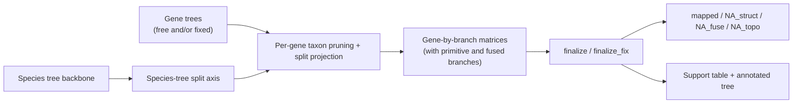

# SplitAligner

**SplitAligner** is a split-based gene tree-species tree reconciliation framework for robust branch mapping under missing taxa, fused branches, and gene-tree/species-tree discordance.

It defines branch identity on a fixed species-tree backbone using canonicalized unrooted edge splits, projects that split space onto each gene tree according to the taxa observed in that gene, and generates standardized gene-by-branch matrices for downstream comparative analyses.

SplitAligner explicitly distinguishes biologically meaningful forms of missingness:

- `NA_struct`: structural absence after taxon pruning causes a projected branch to become undefined
- `NA_fuse`: signal is represented on a fused branch rather than on a primitive branch
- `NA_topo`: the projected branch is decisive under the fixed-topology comparison but absent from the free-topology gene tree

This repository contains the SplitAligner source code, example datasets, and documentation needed to reproduce the core branch-mapping workflow.

Current release: `v1.1.1`

---

## Introduction

On a fixed species-tree spine,

we ask one thing: does branch `b` still hold?

Project the split:

If it collapses - `NA_struct`.

If branches fuse - `Bs1|Bs3`, `NA_fuse`.

If topology turns away - `NA_topo`.

No ghosts, no leaks:

`Total = Mapped + NA_struct + NA_fuse + NA_topo.`

A quiet ledger, where every absence has a name.

---

## Why SplitAligner?

In phylogenomics, branch identity is often treated as though it remains stable across all gene trees. In practice, missing taxa can collapse distinct species-tree branches into the same projected split, and free-topology gene trees can lose decisive projected branches entirely. Under these conditions, naive branch-to-branch comparison becomes unreliable.

SplitAligner addresses this problem by:

- defining branch identity in split space rather than by graphical position or node order
- projecting the species-tree split space onto the observed taxon set of each gene
- recording both exact and fused branch correspondences
- generating standardized branch matrices for downstream comparative analyses
- separating structural, fusion-related, and topology-induced missingness

The central rule is simple:

> branch identity should be defined in projected split space, not assumed to survive taxon pruning unchanged.

---

## Conceptual Positioning

SplitAligner reframes branch identity as a projection problem in split space.

Instead of asking whether a gene tree simply "supports" a species-tree branch, SplitAligner asks whether that branch remains well-defined after taxon pruning, whether it becomes structurally degenerate, whether its signal is absorbed into a fused branch, or whether it is absent because of topological discordance.

This shift turns branch reconciliation from a naive tree-comparison problem into a standardized gene-by-branch matrix construction framework under controlled missingness.

In that sense, SplitAligner is not only a branch-mapping tool. It also provides a branch coordinate system for downstream comparative analyses, where each gene-branch cell can be interpreted within an explicit missingness model rather than as an undifferentiated absence.

In practice, SplitAligner asks a simple question for each gene and each species-tree branch: is this branch still distinguishable, fused, structurally undefined, or topologically absent?

---

## Definition Summary

In finalized SplitAligner matrices, each gene-branch cell is interpreted as either `mapped` or as one of three explicit missingness states: `NA_struct`, `NA_fuse`, or `NA_topo`.

For missing cells in the final matrices, these three `NA_*` labels are intended as mutually exclusive explanatory categories rather than as generic absence codes:

- `NA_struct`: the projected branch is structurally undefined after taxon pruning
- `NA_fuse`: the branch is not present as a primitive branch because its signal is represented on a fused branch
- `NA_topo`: the branch is decisive under the fixed-topology baseline but absent from the free-topology gene tree

This design allows absence states to be analyzed explicitly instead of being collapsed into a single undifferentiated `NA`.

---

## Determinism

All gene-tree splits are mapped onto a fixed species-tree branch coordinate system defined by the input species-tree backbone.

For a given species-tree backbone, branch indexing and branch-matrix construction are deterministic and reproducible: the same species-tree split axis is used for every gene, each gene tree is evaluated by projection onto that fixed coordinate system, and the final matrix is independent of gene-tree processing order.

---

## Relation to Other Approaches

Naive branch comparison typically asks whether a gene tree contains a branch that appears to correspond to a species-tree branch. That logic becomes unstable when taxon pruning changes the projected branch structure, because branch identity may no longer survive as a simple one-to-one correspondence.

SplitAligner instead asks a prior question: does the species-tree branch remain well-defined on the gene-specific taxon set? Only after that projection step does it classify the outcome as mapped, represented by a fused branch, structurally absent, or topologically absent.

Similarly, concordance-style summaries are often used to count supporting and conflicting signal around species-tree branches. SplitAligner can contribute to that broader goal, but its primary role is different: it provides a projection-aware branch coordinate system and a standardized gene-by-branch matrix framework under explicit missingness categories.

---

## Highlights

- Defines branch identity in projected split space rather than by naive branch-to-branch comparison
- Distinguishes three biologically meaningful missingness states: `NA_struct`, `NA_fuse`, and `NA_topo`
- Produces standardized gene-by-branch matrices for both fixed-topology and free-topology gene trees
- Makes fused branches explicit instead of treating projection-induced ambiguity as generic missing data
- Computes branch-wise concordance (`Support`) on the species-tree backbone
- Provides a reproducible example workflow and plain-text outputs for downstream analysis

---

## At a Glance



---

## Main Features

- Split-based branch mapping on a fixed species-tree backbone
- Explicit handling of missing taxa during per-gene projection
- Recognition of fused branch patterns after taxon pruning
- Matrix generation for fixed-topology and free-topology gene-tree sets
- Final classification of generic missing cells into `NA_fuse`, `NA_struct`, and `NA_topo`
- Optional branch-wise `Support` summary and annotated species tree at the end of `finalize`
- Reproducible example workflow included in `examples/302mammal/`

---

## Repository Structure

```text
SplitAligner/
  SplitAligner.pl          main controller
  README.md
  LICENSE
  CITATION.cff

  scripts/
    label_species_tree.pl
    tree_to_splits.pl
    split_branch_label.pl
    generate_branch_matrix.pl
    extract_na_fuse.pl
    confirm_na_structure.pl

  examples/
    302mammal/
      input/
        speciesTree302.nwk
        free_tree.examples.nwk
        fix_tree.examples.nwk
      expected/
    benchmark/
      benchmark.species_tree.nwk
      benchmark.gene_trees.nwk
    preprint_302mammal/
      speciesTree302.nwk
      free.2275genes.nwk
      fix.2275genes.nwk
    run.sh

  benchmark/
    README.md
    scripts/
    inputs/
    outputs/
    docs/

  docs/
    algorithm.md
    benchmark_rules.md
    io_spec.md
    faq.md
```

---

## Requirements

- Perl 5
- Core Perl modules:
  - `Getopt::Long`
  - `Getopt::Std`
  - `File::Basename`
  - `File::Path`
  - `File::Spec`
  - `FindBin`
  - `Cwd`

No external R or non-core Perl dependencies are required for the main workflow.

---

## Installation

Clone the repository:

```bash
git clone https://github.com/wujiaqi06/SplitAligner.git
cd SplitAligner
```

Optionally make the main controller executable:

```bash
chmod +x SplitAligner.pl
```

You can run SplitAligner directly from the repository root:

```bash
perl SplitAligner.pl --help
```

Or add the repository root to your `PATH`:

```bash
export PATH="$PWD:$PATH"
SplitAligner.pl --help
```

To make that persistent:

macOS (`zsh`)

```bash
echo 'export PATH="'"$PWD"'":$PATH' >> ~/.zshrc
source ~/.zshrc
```

Linux (`bash`)

```bash
echo 'export PATH="'"$PWD"'":$PATH' >> ~/.bashrc
source ~/.bashrc
```

---

## Quick Start

Two runnable example configurations are provided.

- `examples/302mammal/`
  Small toy example for quick smoke testing and expected-output comparison.
- `examples/benchmark/`
  Benchmark species tree and gene trees used to test the Perl SplitAligner workflow on benchmark-constructed input trees.
- `examples/preprint_302mammal/`
  Full 2275-gene dataset used for the preprint-scale 302-mammal analysis.

The repository also includes a separate top-level `benchmark/` bundle. This is the R-side oracle package used to construct, inspect, and visualize the benchmark itself. It is intentionally kept separate from `examples/benchmark/`, which serves as the Perl SplitAligner test location for benchmark trees and is not part of the Perl runtime.

From the repository root:

```bash
bash examples/run.sh toy
bash examples/run.sh preprint
```

The `toy` run is intended for fast workflow checks. The `preprint` run reproduces the full analysis-scale pipeline, including branch-wise `Support` and the annotated species tree.

The example workflow performs:

1. matrix generation for free-topology gene trees
2. matrix generation for fixed-topology gene trees
3. final NA classification by comparing the two matrix sets
4. optional `Support` calculation and species-tree annotation if `--species_tree` is provided

Expected reference outputs are provided for the toy example in `examples/302mammal/expected/`.

Minimal command-line usage from the repository root:

```bash
perl SplitAligner.pl --mode matrix --species examples/302mammal/input/speciesTree302.nwk --gene examples/302mammal/input/free_tree.examples.nwk --label free
perl SplitAligner.pl --mode matrix --species examples/302mammal/input/speciesTree302.nwk --gene examples/302mammal/input/fix_tree.examples.nwk --label fix
perl SplitAligner.pl --mode finalize --free free.matrix_with_fuse.txt --fix fix.matrix_with_fuse.txt --final_label final --species_tree species_tree.forSplit.nwk
```

Fix-only example:

```bash
perl SplitAligner.pl --mode matrix --species examples/302mammal/input/speciesTree302.nwk --gene examples/302mammal/input/fix_tree.examples.nwk --label fix
perl SplitAligner.pl --mode finalize_fix --fix fix.matrix_with_fuse.txt --final_label final_fix
```

---

## Reading the Matrix

Final matrices are gene-by-branch tables indexed by the fixed species-tree branch coordinate system. A small schematic example is shown below.

| gene  | B1        | B2        | B3         |
|-------|-----------|-----------|------------|
| gene1 | 0.0512    | NA_topo   | NA_struct  |
| gene2 | NA_fuse   | 0.0248    | 0.0183     |
| gene3 | 0.0431    | 0.0305    | NA_struct  |

- Numeric values indicate mapped branch-associated values for that gene and branch.
- `NA_struct` means the projected branch is not structurally defined for that gene after taxon pruning.
- `NA_fuse` means the branch is not represented as a primitive branch because its signal is captured by a fused branch.
- `NA_topo` means the branch is decisive under the fixed-topology comparison but absent from the free-topology gene tree.

---

## Workflow Overview

SplitAligner runs in two major stages.

### Stage 1: `matrix`

1. Label the species tree with stable branch identifiers
2. Convert species-tree branches into canonicalized unrooted edge splits
3. Convert each gene tree into split form
4. Project the species-tree split space after pruning taxa absent from each gene
5. Detect exact and fused branch correspondences
6. Generate gene-by-branch matrices

### Stage 2: `finalize`

1. Mark primitive-branch `NA` cells that are explained by fused-branch signal as `NA_fuse`
2. Compare fixed-topology and free-topology matrices on shared genes
3. Classify remaining missing values as `NA_struct` or `NA_topo`
4. Optionally compute branch-wise `Support` and write an annotated species tree

### Stage 3: `finalize_fix`

1. Mark primitive-branch `NA` cells that are explained by fused-branch signal as `NA_fuse`
2. In fix-only analyses, rewrite all remaining `NA` cells as `NA_struct`
3. Produce a fix-only classified matrix without invoking `NA_topo`

---

## Command-Line Interface

### `--mode matrix`

Generate branch matrices from a species tree and one gene-tree file.

Required arguments:

- `--species`: species tree in Newick format
- `--gene`: gene-tree file in SplitAligner line-based format
- `--label`: output label or prefix, for example `free` or `fix`

Example: free-topology gene trees

```bash
perl SplitAligner.pl --mode matrix \
  --species input/speciesTree302.nwk \
  --gene input/free_tree.examples.nwk \
  --label free
```

Example: fixed-topology gene trees

```bash
perl SplitAligner.pl --mode matrix \
  --species input/speciesTree302.nwk \
  --gene input/fix_tree.examples.nwk \
  --label fix
```

Main outputs:

- `species_tree.forSplit.nwk`
- `species_tree.FigTree.tre`
- `species_tree.splits.txt`
- `species_tree.branch_map.txt`
- `<label>_splits/`
- `<label>_split_branch_label/`
- `<label>.matrix_no_fuse.txt`
- `<label>.matrix_with_fuse.txt`

### `--mode finalize`

Finalize NA classification from two `matrix_with_fuse` outputs, typically one from fixed-topology gene trees and one from free-topology gene trees.

Required arguments:

- `--free`: free-topology `matrix_with_fuse` file
- `--fix`: fixed-topology `matrix_with_fuse` file
- `--final_label`: output prefix for the classified matrices

Optional argument:

- `--species_tree`: `species_tree.forSplit.nwk` for branch-wise `Support` calculation and tree annotation

Example:

```bash
perl SplitAligner.pl --mode finalize \
  --free free.matrix_with_fuse.txt \
  --fix fix.matrix_with_fuse.txt \
  --final_label final \
  --species_tree species_tree.forSplit.nwk
```

Main outputs:

- `<free>.na_fuse.txt`
- `<fix>.na_fuse.txt`
- `<final_label>.fix.na_classified.txt`
- `<final_label>.free.na_classified.txt`
- `<final_label>.support_b.txt` if `--species_tree` is provided
- `<species_prefix>.support_b.nwk` if `--species_tree` is provided

The final classification step is defined only for genes shared between the fixed-topology and free-topology inputs. If no shared genes are found, SplitAligner stops with an error.

When `--species_tree` is provided, SplitAligner also computes a branch-wise concordance score, `Support(b)`, on the species-tree backbone. In the current implementation, `Support(b)` is defined on genes shared between the fixed-topology and free-topology inputs as:

`Support(b) = 100 * [number of non-NA entries for branch b in the free-topology matrix] / [number of non-NA entries for branch b in the fixed-topology matrix]`

### `--mode finalize_fix`

Finalize NA classification for a fixed-topology matrix when no free-topology comparator is available.

Required arguments:

- `--fix`: fixed-topology `matrix_with_fuse` file
- `--final_label`: output prefix for the classified matrix

Example:

```bash
perl SplitAligner.pl --mode finalize_fix \
  --fix fix.matrix_with_fuse.txt \
  --final_label final_fix
```

Main outputs:

- `<fix>.na_fuse.txt`
- `<final_label>.fix.na_classified.txt`

In `finalize_fix`, SplitAligner first marks `NA_fuse` from fused-branch signal and then interprets all remaining `NA` cells as `NA_struct`. This mode does not define or emit `NA_topo`.

---

## Input Formats

### Species tree

- Format: Newick
- One species tree per run
- Species labels must be consistent with those used in the gene trees
- Branch lengths and internal node annotations are allowed
- Internal annotations are ignored during split-based branch mapping

Accepted examples:

```text
((A,B),(C,D));
```

```text
((A:0.1,B:0.2):0.2,(C:0.1,D:0.1):0.1):0.1;
```

```text
((A:0.1,B:0.2)100:0.2,(C:0.1,D:0.1)95:0.1)100:0.1;
```

### Gene trees

- Format: Newick, one record per line
- Each line begins with a gene identifier followed immediately by a tree
- Species labels must match the species-tree naming convention
- Branch lengths and node support annotations are allowed
- Internal annotations are ignored during split-based mapping

Example:

```text
GeneA((A:0.1,B:0.2):0.2,(C:0.1,D:0.1):0.1):0.1;
GeneB((A:0.2,B:0.1):0.1,(C:0.1,(D:0.1,E:0.2):0.1):0.1):0.1;
GeneC((A:0.1,B:0.2):0.2,(C:0.1,D:0.1):0.4):0.1;
```

---

## Output Files

### Outputs from `matrix`

- `species_tree.forSplit.nwk`
  - species tree relabeled for downstream split processing
- `species_tree.FigTree.tre`
  - species tree annotated for visualization
- `species_tree.splits.txt`
  - canonical species-tree split definitions
- `species_tree.branch_map.txt`
  - mapping between branch identifiers and species-tree subtrees
- `<label>_splits/`
  - per-gene split representations
- `<label>_split_branch_label/`
  - per-gene mapped branch patterns after projection to the species-tree axis
- `<label>.matrix_no_fuse.txt`
  - primitive-branch matrix only
- `<label>.matrix_with_fuse.txt`
  - primitive branches plus fused-branch columns

### Outputs from `finalize`

- `<free>.na_fuse.txt`
  - primitive-branch matrix in which fused-supported `NA` cells are relabeled as `NA_fuse`
- `<fix>.na_fuse.txt`
  - same transformation for the fixed-topology matrix
- `<final_label>.fix.na_classified.txt`
  - fixed-topology matrix after final NA classification
- `<final_label>.free.na_classified.txt`
  - free-topology matrix after final NA classification
- `<final_label>.support_b.txt`
  - branch-wise `Support` summary, including fixed-matrix and free-matrix non-NA counts
- `<species_prefix>.support_b.nwk`
  - standard Newick tree with internal-node `Support` values written in the bootstrap position

---

## Interpretation of NA States

- `NA`
  - generic missing value before final classification
- `NA_fuse`
  - the branch is absent as a primitive branch but represented through a fused branch after taxon pruning
- `NA_struct`
  - the projected branch is structurally absent after projection and is not evaluable for that gene
- `NA_topo`
  - the projected branch is decisive under the fixed-topology comparison but absent from the free-topology gene tree, consistent with topology-induced discordance

These categories are intended to prevent biologically distinct sources of missingness from being conflated in downstream analyses.

---

## Documentation

Additional documentation is available in:

- `docs/algorithm.md`
- `docs/benchmark_rules.md`
- `docs/io_spec.md`
- `docs/faq.md`

---

## Future Directions

The current implementation of SplitAligner focuses on split-based branch mapping, branch-wise `Support` summarization, and NA-state classification under missing taxa, fused branches, and topological discordance.

Several natural extensions are possible in future versions, including:

- additional downstream utilities for branch-matrix parsing, summarization, and visualization
- wrapper packages for R and Python
- performance-oriented implementation of key modules for larger datasets
- expanded support for larger comparative workflows built on projected branch coordinate systems

More generally, SplitAligner provides a practical framework for representing branch correspondence in projected split space.

We expect this representation to support future extensions of branch-wise comparative analyses in phylogenomics and other settings where tree-to-tree topological discordance must be handled explicitly.

---

## Citation

If you use SplitAligner in your work, please cite both the software repository and the associated preprint.

Preprint:

> Wu J. 2026. SplitAligner: A Gene-Species Tree Reconciliation Framework Using Split-Based Branch Mapping. bioRxiv. https://doi.org/10.64898/2026.02.24.707838

Repository citation metadata:
- `CITATION.cff`

---

## Contact

Jiaqi Wu  
Graduate School of Integrated Sciences for Life, Hiroshima University  
Email: `wujiaqi@hiroshima-u.ac.jp`  
Email: `wujiaqi06@gmail.com`
